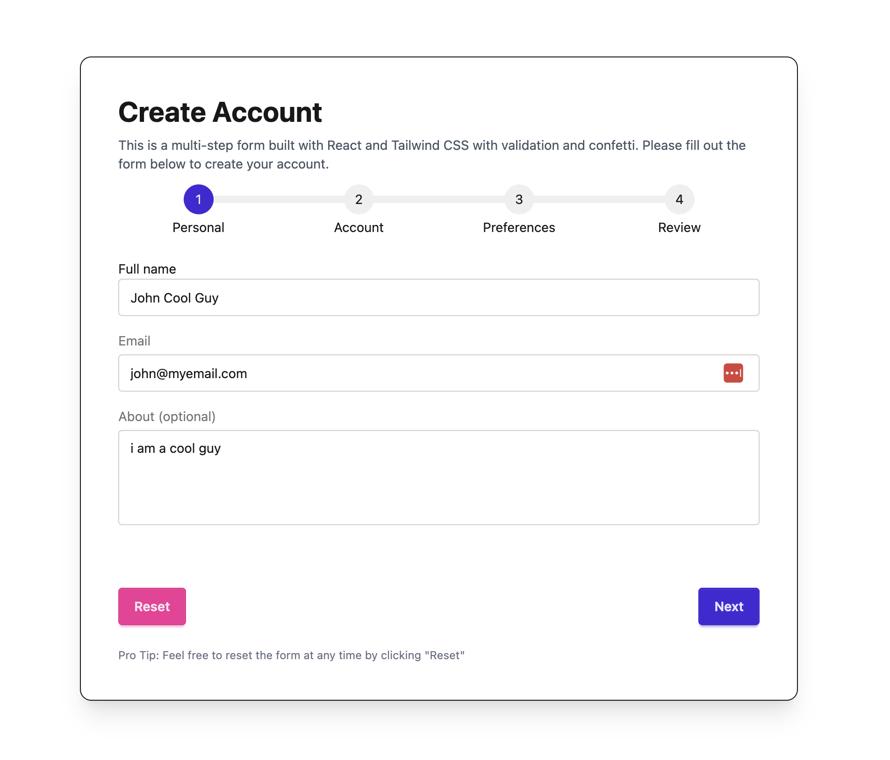
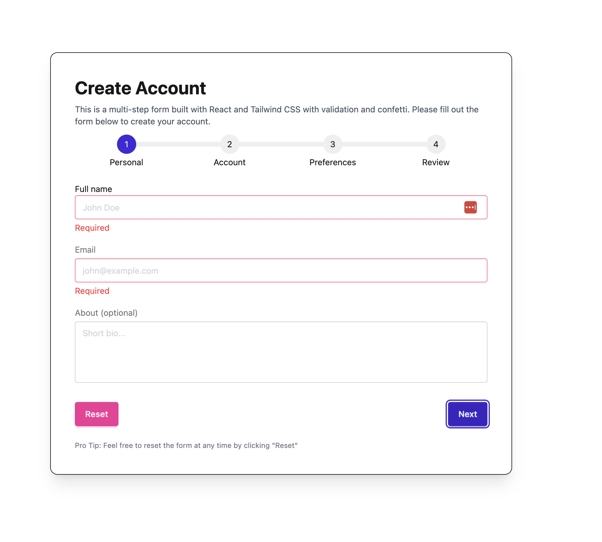
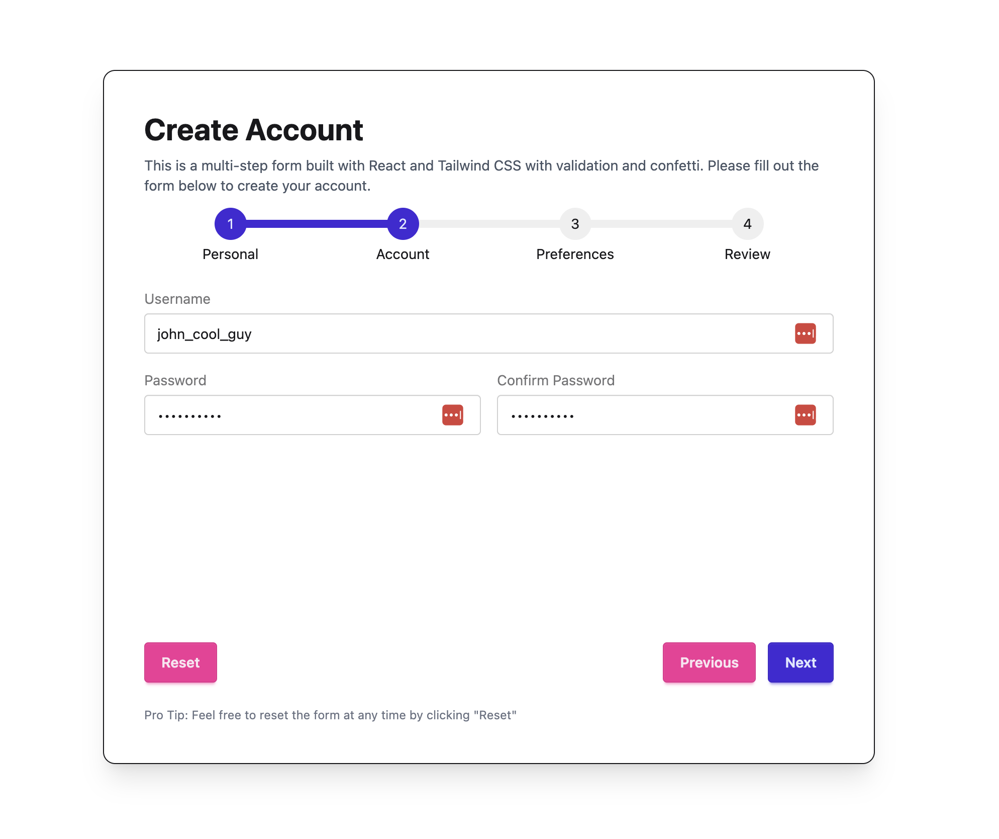
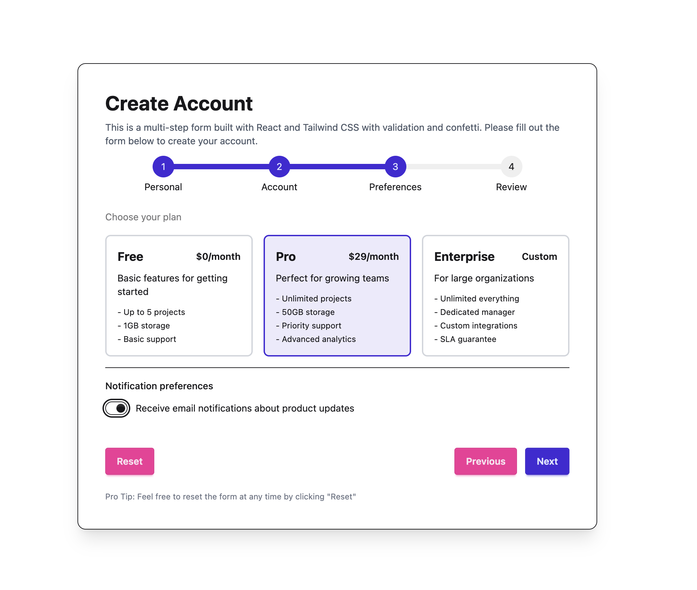
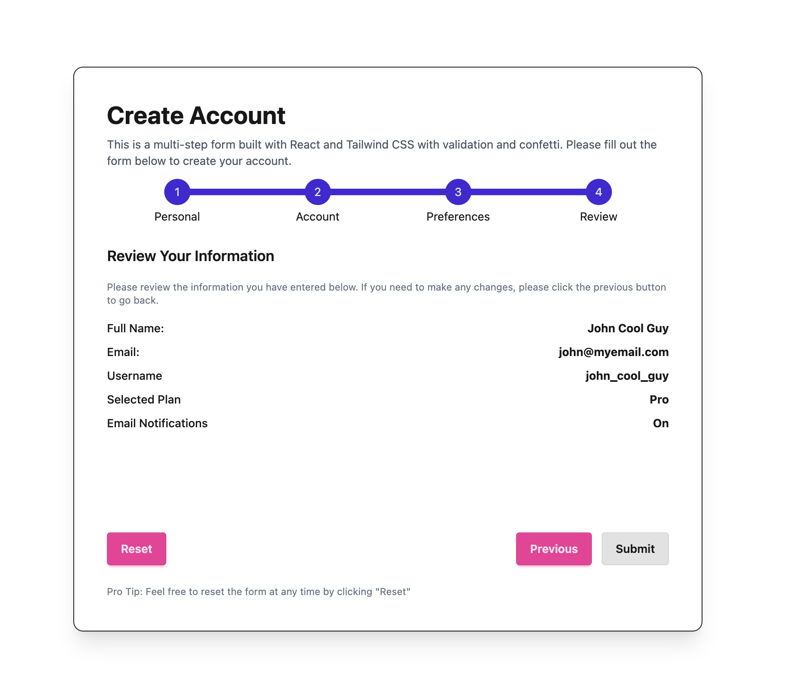

# Multi-Step Form

A very simple UI app created to showcase a multi-step registration form built with **React**, **TypeScript**, **Tailwind CSS**, **DaisyUI**, and **Motion**. It is not production-ready, its done just for fun, focused on form flow, validation, animations, and modern frontend tooling.

## Tech stack

- [React 19](https://react.dev/) + [TypeScript](https://www.typescriptlang.org/)
- [Vite](https://vite.dev/) for dev and build
- [Tailwind CSS v4](https://tailwindcss.com/) + [DaisyUI](https://daisyui.com/) for styling
- [Motion](https://motion.dev/) for step transitions and the success modal
- [canvas-confetti](https://www.npmjs.com/package/canvas-confetti) on successful submit
- [ESLint](https://eslint.org/), [Husky](https://typicode.github.io/husky/), and [lint-staged](https://github.com/lint-staged/lint-staged) for pre-commit checks

## Features

- Four-step form: Personal → Account → Preferences → Review
- Per-step validation (required fields, email, min length, password match)
- Progress bar with DaisyUI steps component
- Animated transitions between steps
- Form data persisted to `localStorage` (survives page refresh)
- Confetti + success modal on submit
- Typed form data and errors (`src/types/form.ts`)

## Screenshots

### Step 1 — Personal info



Validation errors on empty fields:



### Step 2 — Account



### Step 3 — Preferences



### Step 4 — Review



### Complete


## Getting started

```bash
npm install
npm run dev
```

Open the URL shown in the terminal (usually `http://localhost:5173`).

### Other scripts

| Command             | Description                           |
| ------------------- | ------------------------------------- |
| `npm run build`     | Type-check and production build       |
| `npm run preview`   | Preview the production build          |
| `npm run lint`      | Run ESLint                            |
| `npm run typecheck` | Run TypeScript without emitting files |

## Project structure

```
src/
├── assets/          # Screenshots and static images
├── components/
│   ├── MultiStepForm.tsx
│   ├── PersonalInfoStep.tsx
│   ├── AccountInfoStep.tsx
│   ├── PreferencesInfoStep.tsx
│   ├── ReviewInfoStep.tsx
│   └── ProgressBar.tsx
└── types/
    └── form.ts      # FormData, FormErrors, step prop types
```
